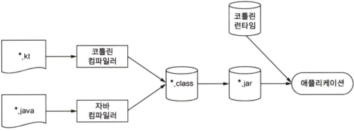

# 코틀린이란 무엇이며, 왜 필요한가?

## 코틀린이란?

* 자바 플랫폼에서 돌아가는 새로운 프로그래밍 언어
* 문법이 자바에 비해 간결하고 실용적이며 자바 코드와 상호 운용성을 중시
    * 기존 자바 라이브러리나 프레임워크와도 잘 작동함
    
## 코틀린 예제

[코틀린 맛보기](src/main/kotlin/study/example/Example01.kt)

```kotlin
// 데이터 클래스 -> 롬복 @Data 어노테이션과 유사한 기능
data class Person(
    // 기본 생성자 선언과 클래스의 프로퍼티 정의
    val name: String,
    val age: Int? = null // 널이 가능한 타입의 경우 표기
)
// 최상위 함수
fun main(/*args: Array<String> // 버전이 올라감에 따라 필수값이 아님*/) {
    /*: List<Person> 타입 추론으로 타입 선언 생략*/
    val persons = listOf(Person("영희"),
        Person("철수", age = 29)) // <- 프로퍼티 지정 파라미터

    val oldest = persons.maxByOrNull { it.age ?:0 } //람다식과 엘비스 연산자
    // 위의 람다 식의 경우 아래와 같은 람다식을 축약형으로 표현한것.
    // persons.maxByOrNull({ person -> person.age ?:0 })
    println("나이가 가장 많은 사람: $oldest") // 문자열 템플릿
}
```

### 코틀린 맛보기 -> 자바 코드

```java
// Person.java

public final class Person {

  private final String name;
  private final Integer age;

  public final String getName() {
    return this.name;
  }

  public final Integer getAge() {
    return this.age;
  }

  public Person(String name, Integer age) {
    this.name = name;
    this.age = age;
  }

  public final String component1() {
    return this.name;
  }

  public final Integer component2() {
    return this.age;
  }

  public final Person copy(String name, Integer age) {
    return new Person(name, age);
  }

  public String toString() {
    return "Person(name=" + this.name + ", age=" + this.age + ")";
  }

  public int hashCode() {
    //... 생략
  }

  public boolean equals(@Nullable Object var1) {
    //... 생략
  }
}
// Example01Kt.java

public final class Example01Kt {

  public static void main(String[] args) {
    List<Person> persons = new ArrayList<>(
            Arrays.asList(
                    new Person("영희", null),
                    new Person("철수", 29)
            )
    );
    Person oldest = persons.stream()
            .max(
                    Comparator.comparingInt({person ->
                            person.getAge() == null ? 0 : person.getAge()})
            )
            .orElseThrow(NoSuchElementException::new);

    System.out.printf("나이가 가장 많은 사람: %s\n", oldest);
  }
}
```
---
## 코틀린 주요 특성

1. 다양한 플랫폼 사용가능  
   서버 (웹 애플리케이션 등), 안드로이드 디바이스 애플리케이션 등...
   
2. 정적 타입 지정 언어  
   __일반적인 정적 타입 언어의 장점__  
- **성능**  
  실행 시점에 어떤 메소드를 호출할지 알아내는 과정이 필요 없으므로 메소드 호출이 더 빠름
- **신뢰성**  
  컴파일러가 프로그램의 정확성을 검증하기에
  실행 시 프로그램이 오류로 중단될 가능성이 더 적어짐
- **유지 보수성**  
  코드에서 다루는 객체가 어떤 타입에 속하는지 알수 있기에 처음 보는 코드를 다룰 때도 더 쉬움
- **도구 지원**  
  정적 타입 지정을 활용하면 더 안전하게 리팩토링 할 수 있고,
  도구는 더 정확한 코드 완성 기능을 제공할 수 있으며,
  IDE의 다른 지원 기능도 더 잘 만들 수 있음
  
3. 함수형 프로그래밍과 객체 지향 프로그래밍  
* [함수형 프로그래밍](FuncionalProgramming.md)
* [일급 객체](FirstClass.md)

코틀린의 함수형 프로그래밍 지원 
* 함수 타입을 지원함에 따라  
  ___어떤 함수가 다른 함수를 파라미터로 받거나 함수가
새로운 함수를 반환할 수 있다.___
* 람다 식을 지원함에 따라  
  번거로운 준비 코드를 작성하지 않아도 코드 블록을 쉽게 정의하고 여기저기 전달할 수 있다.
* 데이터 클래스는 ___불변적인 값 객체___ 를 간편하게 만들 수 있는 구문을 제공한다.
* 코틀린 표준 라이브러리는  
  객체와 컬렉션을 함수형 스타일로 다룰 수 있는 API를 제공한다.
  
코틀린은 함수형 스타일로 프로그램을 짤 수 있게 지원하지만 함수형 프로그래밍 스타일을 강제하지는 않는다. 

명령형 방식이 더 적합한 경우라면 함수형 프로그래밍으로 번거롭게 코드를 작성할 필요 없이  
직접 변경 가능한 데이터와 부수 효과를 활용하는 함수를 사용해도 된다. 

당연히 인터페이스와 클래스 계층 구조를 바탕으로 하는  
___프레임워크도 자바를 사용할 때와 마찬가지로 쉽게 쓸 수 있다.___

코틀린으로 코드를 작성할때는   
객체지향과 함수형 접근 방법을 함께 조합해서 문제에 가장 적합한 도구를 사용하면 된다.

-> 요약하자면 `function` 타입에 대한 지원으로 자바로 작성할 때보다 함수형 프로그래밍에 대한 지원을 해줌.

---

## 코틀린의 철학

자바랑 자꾸 비교하면서, 자바 환경에 문제 없고 쓰기 편하고 안전하고 실용적이라는 내용.

### 메모

단순 프로퍼티 정의나 여러가지 측면에서 코드 량 자체가 줄어들고  
컴파일러와 IDE 상에서 지원으로 `null` 안정성이나 기타 지원이 좋아서 그런듯.

---
## 코틀린 도구 사용

말그대로 도구 사용하여 코틀린 사용하는 방법.

컴파일 부분 외에는 참고만.



코틀린 빌드 과정

---
## 요약
코틀린 자바에 비해 코드를 간결하게 작성할 수 있고

`nullable` 등 컴파일 단계에서 흔하게 발생하는 `NullPointerException` 등 오류를 방지 할 수 있어
자바보다 안전함

최신 트렌드인 함수형 프로그래밍 스타일을 자바보다 더 많이 지원함.
