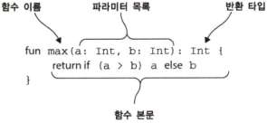

# 코틀린 기초

---

## 함수와 변수

코틀린에서는 자바와 다르게 타입 선언을 생략 가능하다.

코틀린에서 **불변 타입** 과 **가변 타입** 선언

### Hello, World!

어떤 프로그래밍 언어든 기초로 배우는 `Hello, World`

```kotlin
fun main(args: Array<String>) {
	println("Hello, world!")
}
```

함수 선언시 `fun` 을 사용

파라미터 이름 뒤에 해당 파라미터의 타입을 선언 → `args: Array<String>`

함수를 최상위 수준에 정의 가능
자바의 경우 클래스안에서 함수를 넣어야 가능

배열도 일반적인 클래스와 마찬가지

`println` 과 같이 표준 자바 라이브러리를 간결하게 사용가능하게 한 래퍼 함수 제공

세미콜론 필수 아님

### 함수

코틀린에서 함수 선언은 `fun` 키워드로 시작하며 `fun` 다음에는 함수 이름이 온다

함수 이름 뒤에는 괄호 안에 파라미터 목록이 오며

함수의 반환 타입은 닫는 괄호 다음에 오며 `:` 콜론으로 해당 구문 사이를 구별한다

```kotlin
fun max(a: Int, b: Int) : Int {
	return if ( a > b ) a else b
}
```



코틀린 함수 정의 예시

### 문과 식의 구분

코틀린에서 `if` 는 식이지 문이 아니다.

`식(expression)` 은 값을 만들어 내며 다른 식의 하위 요소로 계산에 참여할 수 있는 반면

`문(statement)` 은 자신을 둘러싸고 있는 가장 안쪽 블록의 최상위 요소로 존재하며
아무런 값을 만들어내지 않는다는 차이가 있다.

자바에서는 모든 제어 구조가 문인
***반면 코틀린에서는 루프를 제외한 대부분의 제어 구조가 식이다.***

제어 구조를 다른 식으로 엮어낼 수 있으면 여러 일반적인 패턴을 아주 간결하게 표현할 수 있다.

### 식이 본문인 함수

중괄호 블럭을 생략하고 `=` 등호로 식으로 함수 표현 가능

반환 타입 또한 생략 가능함

코틀린이 정적 타입 언어임에도 반환 타입 생략할 수 있는 이유는?

컴파일러가 **타입 추론** 을 통해 결과 타입을 함수 반환 타입으로 지정해줌.

그러나 생략하지 않는게 더 좋음, → 올바른 반환타입을 지정할 수 있으며, 반환 타입 생략으로 얻는 이점이 코드가 더 짧아져서 읽기 편하다 외에는 없음.

```kotlin
fun max(a: Int, b: Int) : Int = if (a > b) a else b
```

중괄호로 둘러싸인 함수를 **블록이 본문인 함수** , 등호와 식으로 된 함수를 **식이 본문인 함수**

코틀린에서는 식이 본문인 함수가 자주 쓰임

단순한 산술식이나 함수 호출 식뿐만 아니라 `if`, `when`, `try` 등의 더 복잡한 식도 자주 쓰임

---

### 변수

자바에서 변수 선언시 타입이 앞에 오지만, 코틀린에서는 타입을 변수명 뒤에 오며 이 또한 생략이 가능하다.

초기화와 동시에 변수 선언시 **타입추론** 으로 인해 변수 타입 명시를 생략할 수 있으나

초기화를 하지 않고 선언만 할시 반드시 변수 타입을 선언해야 한다.

```kotlin
//타입 표기를 생략한 변수 선언
val sample = "코틀린에서의 변수 선언과 동시에 초기화"

//타입 표기시
val temp: Int = 38

//초기화를 하지 않고 변수 선언시 타입을 반드시 명시해야 함
val temp2: Int
temp2 = 29
```

### 변경 가능한 변수와 변경 불가능한 변수

- `val`
    - 변경 불가능한 `immutable` 참조를 저장하는 변수
    - 자바로 치면 `final` 에 해당함
    - 반드시 한번만 초기화 되야함
        - 코드 블럭 실행됨에 따라 컴파일러가 오직 한번만 실행됨을 확인시
          → 여러값으로도 초기화 가능 (`if else` 식)
    - 불변일지라도 해당 참조가 가리키는 객체의 내부 값은 변경 가능

    ```kotlin
    val languages = arrayListOf ("Java")
    languages.add ("Kotlin")
    ```

- `var`
    - 변경 가능한 `mutable` 참조
    - 자바로 치면 일반 변수
    - 변수 값은 변경할 수 있지만, 타입은 바뀌지 않음.
        - 어떤 타입의 변수에 다른 타입의 값을 저장하고 싶다면 **변환 함수**를 써서 값을 변수
          의 타입으로 변환하거나, 값을 변수에 대입할 수 있는 타입으로 **강제 형변환** 해야 한다

기본적으로는 모든 변수를 `val` 로 불변 변수로 선언후, 필요시 `var` 변경 권장

→ 변경 불가능한 참조와 변경 불가능한 객체를 부수 효과 없는 함수와 조합해서 사용

→ 코드가 좀더 함수형 코드에 가까워짐.

### 문자열 템플릿

```kotlin
fun main(args: Array<String>) {
	val name = if (args.size > 0) args[0] else "코틀린"
	println("Hello, $name!")
}
```

여러 스크립트 언어와 비슷하게 코틀린에서도 변수를 문자열 안에 사용할 수 있다.

문자열 리터럴의 필요한 곳에 변수를 넣되 변수 앞에 `$`를 추가해야 한다

문자열 템플릿 안에 사용할 수 있는 대상은 간단한 변수 이름만으로 한정되지 않는다.

복잡한 식도 중괄호( `{ }`)로 둘러싸서 문자열 템플릿 안에 넣을 수 있다.

```kotlin
fun main(args: Array<String>) {
	if (args.size > 0) {
	println ("Hello, ${args[0]}!") //args 배열의 첫 번째 원소
	}
}
```

중괄호로 둘러싼 식 안에서 큰 따옴표를 사용할 수도 있다

---
### 클래스와 프로퍼티

코틀린의 클래스는 자바 클래스와 유사함

```kotlin
// 코틀린에서의 VO 객체 선언
class Person(val name: String)
```

자바 코드에 비해 소스 량 자체가 줄어들며 보기 편해짐

---

### 프로퍼티

클래스의 개념 목적 `데이터를 캡슐화 하고 캡슐화 한 데이터를 다루는 코드를 한 주체 아래 가두는 것`

자바에서는 데이터를 `필드` 에 저장하며 일반적인 `POJO` 객체 생성시 `private` 필드

클래스에서 해당 필드를 접근 할수 있게 접근자 메소드 (`setter`, `getter`)를 제공함

자바에서 `필드` 와 `접근자` 를 묶어 보통 `프로퍼티` 라고 부름.

이 단순한 작업을 VO마다 해야됨, 보통 `@Lombok` 을 사용해서 처리중

자바 환경에 Lombok이 기형적으로 따라다니는 형태

```kotlin
class Person(
	val name: String, // 읽기 전용 프로퍼티 | private 필드, public 게터 생성
	var isMarried: Boolean // 변경 가능 프로퍼티 | private 필드, public 게터, 세터 생성
)
```

코틀린에서 프로퍼티를 선언 하는 방식은 프로퍼티와 관련 있는 접근자를 선언하는것.

### 커스텀 접근자

코틀린에서 생성되는 생성자 외에 직접 작성하는 방법

```kotlin
class Rectangle (val height: Int, val width: Int) {
	val isSquare: Boolean
		get() { // 프로퍼티 게터 선언
			return height == width
		}
}
```

---

### 디렉토리와 패키지

코틀린에서는 여러 클래스를 한 파일에 넣을 수 있고, 파일의 이름도 마음대로 정할 수 있다.

코틀린에서는 디스크상의 어느 디렉터리에 소스코드 파일을 위치시키든 관계없다.

따라서 원하는 대로 소스코드를 구성할 수 있다.

예를 들어 `geometry.shapes`라는 패키지가 있다면

그 패키지의 모든 내용을 `shapes.kt`라는 파일에 넣고, 하위 패키지에 해당하는 별도의 디렉터리를 만들지 않고  `geometry`라는 폴더 안에 `shapes.kt`를 넣어도 된다.

→ 하지만 이럴경우 프로젝트가 커질경우 자바 코드와 혼합해서 사용시 올바른 위치를 찾을 수 없는 문제가 생길 수 있으므로 자바와 마찬가지로 패키지와 디렉토리 구조를 일치화 시키는것이 좋음.

---
### 선택 표현과 처리
`enum` 과 `when`

`when` 의 경우 자바의 `swith-case` 문을 대치하는 요소

---
### enum 클래스 정의

```kotlin
enum class Color {
	RED, ORANGE, YELLOW, GREEN, BLUE, INDIGO, VIOLET
}
```

코틀린에서 `enum` 은 **소프트 키워드**라 부르는 존재로

`enum` 은 `class` 앞에서는 특별한 의미를 지니지만 다른 곳에서는 이름에 사용 가능!

---
### 프로퍼티와 메소드가 있는 enum 

자바와 마찬가지로 프로퍼티와 메소드 정의 가능.

```kotlin
enum class Color (
	val r: Int, val g: Int, val b: Int // enum 상수의 프로퍼티 정의
) {
	// 각 상수 생성시 프로퍼티 지정
	RED(255,0,0), ORANGE(255,165,0),
	YELLOW(255,255,0), GREEN(0,255,0), BLUE(0,0,255),
	INDIGO(75,0,130), VIOLET(238,130,238); //세미콜론 필수
	
	// enum 클래스 안에서 메소드 정의
	fun rgb() = (r * 256 + g) * 256 + b 
}
```
---

### when 으로 enum 클래스 다루기
코틀린에서 `when` 도 식이기 때문에 함수에 `when` 을 바로 사용할 수 있음.

```kotlin
fun getMnemonic(color : Color) = 
	when(color) {
		Color.RED -> "홍길동"
		Color.ORANGE -> "김서방"
		Color.YELLOW -> "아무개"
		Color.GREEN -> "갑을병"
		Color.BLUE -> "코틀린"
		Color.INDIGO -> "재밌다"
		Color.VIOLET -> "정말로"
}
```

자바와 달리 `break` 필요 없음

```kotlin
fun getWarmth (color : Color) = when (color) {
	Color.RED, Color.ORANGE, Color.YELLOW -> "warm"
	Color.GREEN -> "neutral"
	Color.BLUE, Color.INDIGO, Color.VIOLET -> "cold"
}
```

한 분기안에서 여러 매치 패턴을 사용할 경우 값 사이를 `,` 콤마로 분리

---
### when과 임의의 객체를 함께 사용

```kotlin
fun mix(c1: Color, c2: Color) =
	when (setOf(c1, c2)) {
		setOf(RED, YELLOW) -> ORANGE
		setOf(YELLOW, BLUE) -> GREEN
		setOf(BLUE, VIOLET) -> INDIGO
		else -> throw Exception("Dirty color") // 분기 조건에 맞는 값이 없을 경우
	}
```

`when` 식에 여러 객체를 함께 사용하여 매칭 결과를 비교할 수 있음

다만 분기 조건 비교시 여러 `Set` 인스턴스가 생성되기에 효율성을 늘리기 위해선

다른 방법으로 비교한다

```kotlin
fun mixOptimized ( c1: Color, c2: Color ) =
    when { // when 에 아무 인자도 없다.
        (c1 == RED && c2 == YELLOW) ||
        (c1 == YELLOW && c2 == RED) ->
            ORANGE
        (c1 == YELLOW && c2 == BLUE) ||
        (c1 == BLUE && c2 == YELLOW) ->
            GREEN
        (c1 == BLUE && c2 == VIOLET) ||
        (c1 == VIOLET && c2 == BLUE) ->
            INDIGO
        else -> throw Exception("Dirty color ")
    }
```

`when` 에 아무 인자도 없으려면 각 분기의 조건이 불리언 결과를 계산하는 식이어야 한다.

이 경우 추가 인스턴스를 생성하지 않지만 가독성이 더 떨어진다.

---
### 스마트 캐스트
예제로 (1 + 2) + 4 와 같은 간단한 산술식을 계산하는 함수

```kotlin
interface Expr
class Num(val value: Int) : Expr
class Sum(val left: Expr, val right: Expr): Expr
```

예제인 `Expr` 인터페이스엔 두가지 구현 클래스가 존재

- 식이 수일 경우 → 그 값 반환
- 식이 합계일 경우 → 좌항 우항 값 계산 후 그 값을 합한 값 반환

```kotlin
fun eval(e: Expr) :Int {
    if( e is Num){
        val n = e as Num //강제 형변환
        return n.value
    }
    
    if( e is Sum) {
        return eval(e.left) + eval(e.right) // 스마트 캐스트
    }

    throw IllegalArgumentException("Unknown expression")
}
```

코틀린에서는 `is` 를 사용해 변수 타입을 검사한다

`is` 는 자바의 `instanceof` 와 비슷하다

자바에서는 `instanceof` 으로 타입 확인후 명시적으로 변수 타입 캐스팅

코틀린에서는 프로그래머 대신 컴파일러가 캐스팅을 해준다.

어떤 변수가 원하는 타입인지 일단 `is` 로 검사하고 나면

굳이 변수를 원하는 타입으로 캐스팅하지 않아도

마치 처음부터 그 변수가 원하는 타입으로 선언된것처럼 사용할 수 있다. 하지만 실제로는 컴파일러가 캐스팅을 수행해준다.

이를 **스마트캐스트**라고 부른다.
