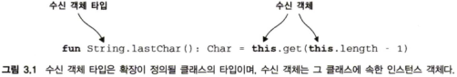
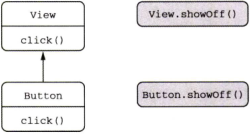
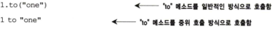
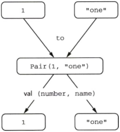
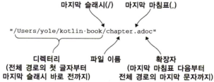
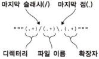

# 함수 정의와 호출
코틀린의 개선된 `함수 정의` 와 `함수 호출` 기능

`확장 함수` 와 프로퍼티를 사용 자바 라이브러리를 코틀린 스타일 적용

`확장` 을 통한 코틀린 장점 확대

---

### 코틀린에서 컬렉션 만들기

코틀린에서 컬렉션 초기화 및 선언하는 방법

**기본적으로 생성되는 컬렉션은 불변 타입**

### List

불변 리스트 - `listOf()`

가변 리스트 - `mutableListOf()` , `arrayListOf()` 등...

### Set

불변 셋 - `setOf()`

가변 셋 - `mutableSetOf()` , `hashSetOf()` , `linkedSetOf()` , `sortedSetOf()`  등...

### Map

불변 맵 - `mapOf()`

가변 맵 - `mutableMapOf()`, `hashMapOf()` , `linkedMapOf()` , `sortedMapOf()` 등...

해당 함수로 생성된 클래스는 기존 자바 콜렉션과 같은 클래스

---
### 함수를 호출하기 쉽게 만들기

자바 콜렉션에는 디폴트 `toString` 구현이 들어있음.

해당 함수 구현을  변경하기 위해서는

자바 프로젝트의 경우 `Guava` 나 `Apache Commons` 같은 서드 파티 프로젝트 추가나 직접 관련 로직 구현

코틀린의 경우, 해당 사항을 처리할 수 있는 함수를 표준 라이브러리에서 제공(?)

예시로 코틀린 직접 구현

```kotlin
fun <T> joinToString(
		collection: Collection<T>,
		separator: String,
		prefix: String,
		postfix: String
) : String {
		val result = StringBuilder(prefix)
		for ((index, element) in collection.withIndex()) {
			if(index>0) result.append(separator)
			result.append(element)
		}

		result.append(postfix)
		return result.toString()
}
```

### 이름 붙인 인자 `Named arguments`

함수 호출시 하나 이상의 인수의 이름을 지정 가능

함수에 많은 인수가 있고 `Boolean` 또는 `Value` 경우 유용

`joinToString(collection, separator = " ", prefix = " ", postfix = ".")`

### 디폴트 파라미터 `Default arguments`

코틀린에서는 함수 선언시 **파라미터의 디폴트 값**을 지정 할 수 있음

```kotlin
fun <T> joinToString(
		collection: Collection<T>,
		separator: String = ", ",
		prefix: String = "",
		postfix: String = ""
): String
```

호출시에는 이름을 생략할시, 함수 선언할 때와 같은 순서로 인자 지정

중간에 있는 인자 생략시, 지정 인자에 이름을 붙여서 지정
### 정적인 유틸리티 클래스 없애기: 최상위 함수와 프로퍼티

자바에서는 보통 모든 코드를 클래스의 메소드로 작성한다.

단순한 연산을 위해 다양한 정적 메소드를 생성하게 되는데,

생성된 정적 메소드만 모아두는 유틸리티 클래스를 생성하는 경우가 많이 생긴다.

JDK의 `Collections` 클래스가 그 예시

코틀린의 경우 해당 함수를 소스 파일의 최상위 수준, 다른 클래스 밖으로 위치시키면 된다.

해당 함수 사용시에는 함수가 정의된 패키지 임포트하면 되고

유틸리티 클래스 이름이 추가로 들어갈 필요는 없다

```kotlin
package strings

fun joinToString(/**/): String {
	// ...
}
```

```kotlin
//자바 코드의 경우
import strings.JoinKt;

public class JoinKt {
	public static String joinToString(/**/) { 
			//...
	}
}
```

코틀린 컴파일러가 생성하는 클래스 명칭은 최상위 함수가 들어 있던 코틀린 소스 파일 이름과 대응

따라서 자바 코드로 변환시 코틀린 파일의 모든 최상위 함수는 해당 클래스의 정적인 메소드가 된다.

### 최상위 프로퍼티

함수와 마찬가지로 프로퍼티도 파일의 최상위 수준에 놓을 수 있다.

보통 상수 처리하는 프로퍼티를 사용하게 되는데

자바의 경우 `public static final` 을 통해 생성한다

이와 같이 코틀린에서 사용시 `const val` 키워들 붙여서 사용시 동일하게 생성된다

다만, 원시 타입과 `String` 타입만 `const` 로 지정할 수 있다.

---
### 메소드를 다른 클래스에 추가: 확장 함수와 프로퍼티

기존 자바 API를 재작성 하지 않고도 코틀린의 편리한 기능을 사용할 수 있게 해주는 `확장 함수`

> 확장함수는 어떤 클래스의 멤버 메소드인 것처럼 호출할 수 있지만
그 클래스의 밖에 선언된 함수

선언 예시

```kotlin
package strings

fun String.lastChar(): Char = this.get(this.length-1)
// 수신 객체 멤버에 this 없이 접근 가능
fun String.lastChar(): Char = get(length-1) 
```

확장 함수를 만들려면 추가하려는 함수 이름 앞에 확장할 클래스 이름을 덧붙이면 됨

해당 클래스 이름을 `수신 객체 타입` 으로 부름

확장 함수가 호출 되는 대상이 되는 값을 `수신 객체` 라고 부름



해당 함수를 호출하는 구문은 다른 일반 클래스 멤버를 호출하는 구문과 동일하다.

확장 함수 내부에서는 일반적인 인스턴스 메소드의 내부에서와 마찬가지로 수신 객체의
메소드나 프로퍼티를 바로 사용할 수 있다

하지만 확장 함수가 캡슐화를 깨지는 않는다!

클래스 내에서 정의한 메소드와 달리 확장 함수 안에서는 `private` 이나 `protected` 멤버를 사용할 수 없다

### 임포트와 확장 함수

**확장 함수를 사용하기 위해서는 그 함수를 다른 클래스나 함수와 마찬가지로 임포트해야만 한다**

`as` 키워드를 사용하면 임포트한 클래스나 함수를 다른 이름으로 부를 수 있다.

코틀린 문법상 확장 함수는 반드시 짧은 이름을 써야 한다.

따라서 임포트할 때 이름을 바꾸는 것이 확장 함수 이름 충돌로 해결할 수 있는 유일한 방법이다.

### 자바에서 확장 함수 호출

내부적으로 확장 함수는 수신 객체를 첫번째 인자로 받는 정적 메소드

**따라서 확장 함수를 호출해도 다른 어댑터 객체나 실행 시점 부가 비용이 들지 않음**

```java
//자바 코드
char c = StringUtilKt.lastChar("Java");
```

### 확장 함수로 유틸리티 함수 정의

예시 코드만 남겨둠  
앞에서 나온 확장 함수를 통해 유틸리티 클래스를 클래스 밖에서 정의 해서 처리하는 방법.

```kotlin
fun <T> Collection<T>.joinToString(
	separator: String = ", ",
	prefix: String = "", 
	postfix: String = ""
): String {
	val result = StringBuilder(prefix)
	
	for((index, element) in this.withIndex()){
		if(index>0) result.append(separator)
		result.append(element)
	}
	result.append(postfix)
	return result.toString()
}
```

### 확장 함수는 오버라이드할 수 없다

확장 함수가 정적 메소드와 같은 특징을 가지므로，확장 함수를 하위 클래스에서 오버라
이드할 수는 없다

확장 함수는 클래스의 일부가 아니다. 확장 함수는 클래스 밖에 선언된다.



View 와 하위 클래스인 Button 예시

확장 함수를 호출할 때 수신 객체로 지정한 변수의 정적 타입에 의해 어떤 확장 함수가 호출될지 결정되지, 그 변수에 저장된 객체의 동적인 타입에 의해 확장 함수가 결정되지 않는다

확장 함수를 첫 번째 인자가 **수신 객체인 정적 자바 메소드로 컴파일**한다는 사실을 기억한다면 이런 동작을 쉽게 이해할 수 있다

### 확장 프로퍼티

프로퍼티라는 이름으로 불리기는 하지만 상태를 저장할 적절한 방법이 없기 때문에

실제로 확장 프로퍼티는 아무 상태도 가질 수 없다.

확장 프로퍼티도 일반적인 프로퍼티와 같은데, 수신 객체 클래스가 추가 됐을 뿐

뒷받침하는 필드가 없어서 기본 게터 구현을 제공할 수 없으므로 최소한 게터는 정의해야함

```kotlin
//확장 함수를 확장 프로퍼티 문법으로 변경
val String.lastChar: Char
	get() = get(length -1 )
```

`StringBuilder` 에 같은 프로퍼티 정의시 `StringBuilder` 맨 마지막 문자는 변경 가능함으로 프로퍼티를 `var` 로 만들 수 있다

```kotlin
var StringBuilder.lastChar: Char
		get() = get(length-1)
		set(value: Char) {
			this.setCharAt(length -1 ,value)
		}
```

---
### 컬렉션 처리: 가변 길이 인자, 중위 함수 호출, 라이브러리 지원

- `vararg` 키워드 사용시 가변 인자 함수 정의할 수 있음
- 중위 `infix` 함수 호출 구문을 사용하면 인자가 하나뿐인 메소드를 간편하게 호출 가능
- 구조 분해 선언 `destructuring declaration` 을 사용하면 복합적인 값을 분해해서 여러 변수에 나눠 남을 수 있음

### 자바 컬렉션 API 확장

코틀린 컬렉션은 자바와 같은 클래스를 사용하지만 더 확장된 API를 제공

```kotlin
// 마지막 원소를 가져오는 예
val strings = listOf("첫번째", "두번째", "세번째")
strings.last() //세번째
```

```kotlin
// 숫자로 이뤄진 컬렉션의 최대값 예
val numbers = setOf(1,14,2)
numbers.max() // 14
```

이전 내용에서 알다싶이 `last()` , `max()` 는 모두 확장 함수

추가로 표준 라이브러리 참조 매뉴얼을 살펴보면 각 라이브러리 클래스가 제공하는 모든 메소드를 볼 수 있음.

### 가변 인자 함수: 인자의 개수가 달라질 수 있는 함수 정의

리스트 생성 함수 예시 `listOf()`

`fun listOf<T> (vararg values: T) : List<T> { ...}`

자바의 경우 타입 뒤에 `...` 을 붙이지만, 코틀린의 경우 파라미터 앞에 `vararg` 변경자를 붙인다

가변 길이 인자를 넘길때도 자바와 다르게 사용하는데

자바에서는 배열을 그냥 넘기면 되지만, 코틀린에서는 배열을 명시적으로 풀어서 전달한다.

기술적으로는 `*` 표기하는 `스프레드` 연산자가 해당 작업을 처리한다

```kotlin
fun main(args : Array<Strings>) {
	val list = listOf("args: ", *args) // 스프레드 연산자가 배열의 내용을 풀어서 전달.
	println(list)
}
```

### 값의 쌍 다루기: 중위 호출과 구조 분해 선언

맵 생성 함수 예시

`val map = mapOf(1 to "one", 7 to "seven", 53 to "fifty-three")`

`to` 는 **중위 호출** `infix call` 이라는 방식으로 `to` 라는 일반 메소드 호출한것

중위 호출 시에는 수신 객체와 유일한 메소드 인자 사이에 메소드 이름을 넣음



중위 호출이 가능한 경우

1. 인자가 하나뿐인 일반 메소드
2. 인자가 하나뿐인 확장 함수

함수를 중위 호출에 사용하게 허용하려면 `infix` 변경자를 함수 선언 앞에 추가해야 함

`infix fun Any.to(other: Any) = Pair(this, other)`

`to` 함수를 간략하게 나타낸 형태

`Pair` 는 코틀린 표준 라이브러리 클래스로 두 원소로 이뤄진 순서쌍 표현

`val (number, name) = 1 to "one"` 과 같이 두 변수를 즉시 초기화 가능

해당 기능을 **구조 분해 선언 `destructuring declaration`** 이라고 함



구조 분해 예시

---
#문자열과 정규시 다루기

코틀린 문자열은 자바 문자열과 같음

특별한 변환도 필요 없고 자바 문자열을 감싸는 별도의 래퍼도 생기지 않음

코틀린은 다양한 확장 함수를 제공함

### 문자열 나누기

자바에서 `12.345-6.A` 를 `split` 메소드를 통해 `.` 으로 분리시

`[12, 345-6, A]` 로 예상되지만, `split` 구분 문자열은 실제로는 정규식으로 사용되어

빈 문자열이 나온다

코틀린에서는 이러한 혼동을 야기하는 메소드를 감추는 여러 가지 다른 조합의 `split` 확장 함수를 제공한다.

정규식을 파라미터로 받는 함수는 `Regex` 타입을 값으로 받아 처리한다

코틀린 정규식 문법은 자바와 똑같다

정규식을 처리하는 API 는 표준 자바 라이브러리 API 와 비슷하지만 좀 더 코틀린답게 변경됐다.

예를 들어 코틀린에서는 `toRegex` 확장 함수를 사용해 문자열을 정규식으로 변환할 수 있다

`split` 확장 함수에는 구분 문자열을 하나 이상을 인자로 받는 함수도 존재하여 구분 문자열이 여러개를 동시에 넣어 처리도 가능하다

### 정규식과 3중 따옴표로 묶은 문자열

임의 파일의 전체 경로명을 디렉토리, 파일 이름, 확장자로 구분짓는 함수를 예시로 설명



### String 확장 함수를 사용할 경우

```kotlin
fun parsePath(path: String) {
	val directory = path.substringBeforeLast ("/")
	val fullName = path.substringAfterLast("/")
	val fileName = fullName.substringBeforeLast(".")
	val extension = fullName.substringAfterLast(".")
	println("Dir: $directory, name: $fileName, ext: $extension")
}

fun main(){
	parsePath("/some/dir/kotlin/sample/StringFunc.docs")
}
```

코틀린에서는 정규식을 사용하지 않고도 문자열을 비교적 쉽게 파싱할 수 있다.

정규식의 경우 강력하긴 하지만 나중에 알아보기 힘든 경우가 많다

### 정규식을 사용하는 예

```kotlin
fun parsePath(path: String) {
	val regex = """(.+)/(.+)\.(.+)""".toRegex()
	val matchResult = regex.matchEntire(path)
	if (matchResult != null) {
		val (directory, filename, extension) = matchResult.destructured
		println("Dir: $directory, name: $filename, ext: $extension")
	}
}
```

3중 따옴표 문자열 `""" """` 에서는 역슬래시 `\` 를 포함한 어떤 문자도 이스케이프 할 필요 없다



정규식을 만들고 정규식 매칭에 성공하면 그룹별로 분해하여 `destructured` 프로퍼티를 각 변수에 대입 (구조 분해)

### 여러 줄 3중 따옴표 문자열

3중 따옴표 문자열을 단순히 문자열 이스케이프를 피하기 위해서만 사용하지는 않는다

3중 따옴표 문자열에는 줄 바꿈을 아무 문자열이나 이스케이프 없이 그대로 들어간다

3중 따옴표 문자열 안에 `$`를 넣어야 한다면 `val price = """${ ’$’ } 99.9，"""`처럼 어쩔 수 없이 문자열 템플릿 안에 `'$'`문자를 넣어야 한다.

---
#코드 다듬기: 로컬 함수와 확장

> 많은 개발자들이 좋은 코드의 중요한 특징 중 하나가 중복이 없는 것이라 믿는다.

자바 코드 작성시에 반복을 피하기 쉽지는 않다

많은 경우 메소드 추출 리팩토링을 적용해 긴 메소드를 부분 부분 나눠 각 부분을 재활용하는데

작은 부분으로 리팩토링시 클래스안에 작은 메소드가 많아지고 각 메소드간 관계를 파악하기 힘들어서 코드를 이해하기 더 어려워질 수도 있다.

리팩토링 진행후 추출한 메소드를 별도의 내부 클래스에 넣으면 비교적 코드를 깔끔하게 구조화 시킬 수 있으나, 그에 따른 준비 코드가 생성된다.

코틀린의 경우에는 리팩토링 과정으로 추출된 함수를 원 함수 내부에 중첩 시킬 수 있다

`local` 로컬 함수를 통해 이를 해결한다.

```kotlin
// 코드 중복을 보여주는 예시
class User(val id: Int, val name: String, val address: String)

fun saveUser(user: User) {
	if (user. name. isEmpty ()) { 
		throw IllegalArgumentException(
			"Can't save user $ {user, id}: empty Name")
	}

	if (user.address.isEmpty()) {
		throw IllegalArgumentException (
			"Can't save user ${user.id}: empty Address")
	}
	// user 를 데이터베이스에 저장한다.
}
```

```kotlin
class User(val id: Int, val name: String, val address: String)

fun saveUser(user: User) {
	fun validate (user: User,
		value: String,		
		fieldName : String) {
			if ( value.isEmpty() ){
				throw IllegalArgumentException (
				"Can't save user ${user.id}: empty $fieldName")
			}
		}
		// 로컬 함수를 호출해서 각 필드 검증
		validate(user, user.name, "Name")
		validate(user, user.address, "Address")
		// user 를 데이터베이스에 저장한다.
}
```

로컬 함수는 자신이 속한 바깥 함수의 모든 파라미터와 변수를 사용할 수 있음.

```kotlin
class User(val id: Int, val name: String, val address: String)

fun saveUser(user: User) {
	fun validate (value: String, fieldName : String) {
			if ( value.isEmpty() ){
				throw IllegalArgumentException (
				// 바깥 함수의 파라미터에 직접 접근 가능
				"Can't save user ${user.id}: empty $fieldName")
			}
		}
		validate(user.name, "Name")
		validate(user.address, "Address")
		// user 를 데이터베이스에 저장한다.
}
```

이를 더 개선하자면 User 클래스의 확장함수로 생성한다

```kotlin
class User(val id: Int, val name: String, val address: String)

fun User.validateBeforeSave() {
	fun validate (value: String, fieldName : String) {
			if ( value.isEmpty() ){
				throw IllegalArgumentException (
				// 바깥 함수의 파라미터에 직접 접근 가능
				"Can't save user $id: empty $fieldName")
			}
		}
		validate(name, "Name")
		validate(address, "Address")
		// user 를 데이터베이스에 저장한다.
}

fun saveUser(user: User) {
	user.validateBeforeSave()
	// user 를 데이터베이스에 저장
}
```

확장 함수를 로컬 함수로 정의할 수도 있다.

즉 `User .validateBeforeSave` 를 `saveUser` 내부에 로컬 함수로 넣을 수 있다.

하지만 중첩된 함수 깊이가 깊어지면 코드를 읽기가 상당히 어려워진다.

일반적으로는 한 단계만 함수를 중첩시키라고 권장한다.