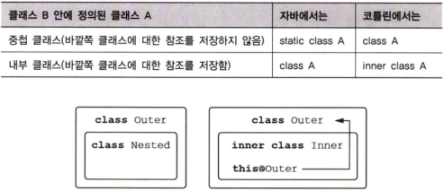
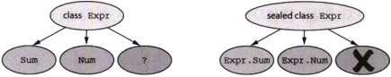

# 클래스, 객체, 인터페이스
코틀린의 클래스와 인터페이스는 자바와는 약간 다르다

---
### 자바와 코틀린 다른점

* 인터페이스에 프로퍼티 선언이 들어갈 수 있다
* 기본적으로 `final` 이며 `public`
* 중첩클래스는 내부 클래스가 아님 → 즉, 외부 클래스에 대한 참조가 없음.
* 프로퍼티의 경우 간결한 구문도 가능하나, 필요시 접근자를 직접 정의가능
* `data` 와 같은 코틀린 컴파일러가 제공하는 표준 메소드 제공
* 코틀린 언어의 `위임 delegation` 사용시 위임 처리하는 준비 메소드도 가능
* 싱글턴, 동반 객체 `companion object` , 객체 식 `object expression` (자바의 익명 클래스) 표현시 `object` 키워드를 통한 지원

---
### 클래스 계층 정의

자바와 다른점 위주로...

### 코틀린 인터페이스 

코틀린 인터페이스는 자바 8의 인터페이스와 비슷하다

- 추상메소드, 디폴트 메소드 정의 가능
- 필드 정의 불가능

```kotlin
// 인터페이스 정의
interface Clickable {
	fun click()
}
```

```kotlin
// 인터페이스 구현
class Button: Clickable {
	override fun click() = println("클릭 가능")
}
```

자바에서는 `extends`와 `implements` 키워드로 정의하지만

코틀린에서는 `:` 붙이고 인터페이스 혹은 클래스 이름을 적는것으로 모두 처리

코틀린에서는 자바와 다르게 `override` 변경자를 반드시 사용해야함

```kotlin
// 인터페이스 선언시 메소드 본문 정의
interface Clickable {
	fun click()
	fun showOff() = println("클릭 가능") // 디폴트 구현
}
```

```kotlin
interface Focusable {
	fun setFocus(b: Boolean) =
		println("포커스 ${if (b) "ON" else "OFF"}")
	fun showOff() = println("포커스 가능")
}
```

디폴트 메소드 명칭이 같은 인터페이스를 한 클래스에서 구현 할 경우

구현 클래스에서 오버라이딩 하지 않을시 컴파일 오류 발생

```kotlin
class Button : Clickable, Focusable {
	override fun click() = println("클릭 됨!")
	override fun showOff() {
		// 상위 타입 이름을 꺽쇠 괄호 <> 사이에 넣어서 "super" 지정시
		// 어떤 상위 타입의 메소드를 호출할지 지정 가능.
		super<Clickable>.showOff() 
		super<Focusable>.showOff()
	}
}
```

자바에서는 `Clickable.super.showOff ()` 처럼 `super` 앞에 기반 타입을 적지만,

코틀린에서는 `super<Clickable>.showOff ()` 처럼 꺾쇠 괄호 안에 기반 타입 이름을 지정한다.

### open, final, abstract 변경자: 기본적으로 final
자바에서 `final` 로 명시적으로 상속을 금지하는 않는 모든 클래스를 다른 클래스가 상속가능하다.

기본적으로 상속이 가능한 자바 클래스로  생기는 문제로 `취약한 기반 클래스` 문제로

기반 클래스 변경으로 인한 상속클래스의 변동사항이다

기반 클래스 변경시나 기타 다른 이유로 하위 클래스 동작이 예기치 않게 바뀔수 있어 기반 클래스는 취약하다

`이펙티브 자바` 에서는

> 상속을 위한 설계와 문서를 갖추거나, 그럴 수 없다면 상속을 금지하라

이는 오버라이드를 의도한 클래스나 메소드가 아니면 `final` 로 만들라는 것.

코틀린은 이 철학을 따라, 기본적으로 클래스와 메소드 모두 `final` 이다

상속을 허용하려면 클래스 앞에 `open` 변경자를 붙여야 한다

메소드나 프로퍼티에도 오버라이드 허용하려면 `open` 변경자를 필요로 한다

```kotlin
open class RichButton: Clickable { // open 키워드로 상속에 대해 열림 선언
	fun disalbe() {} // 별다른 키워들 안붙힐시 기본적으로 final로, 하위 클래스에서 오버라이드 불가
	open fun animate() {} // open 키워드로 하위 클래스에서 오버라이드 가능
	override fun click() {} // 오버라이드 된 메소드는 기본적으로 open
// final override fun click() {} 오버라이드 메소드를 상속 금지하려면 final 키워드 추가
}
```

추상 클래스, 메소드는 자바처럼 사용할 수 있음 `abstract` 선언 후 구현 객체에서 오버라이드를 반드시 해야 함으로 `open` 변경자를 명시할 필요가 없음


### 가시성 변경자: 기본적으로 공개

가시성 변경자란?

코드 기반에 있는 선언에 대한 클래스 외부 접근을 제어한다.

어떤 클래스의 구현에 대한 접근을 제한함으로써 그 클래스에 의존하는 외부 코드를
깨지 않고도 클래스 내부 구현을 변경할 수 있다.

코틀린의 기본 가시성은 자바와 다르다.
아무 변경자도 없는 경우 선언은 모두 공개다 .

또한 자바의 기본 가시성인 패키지 전용도 코틀린에 없다

코틀린에서 패키지는 네임스페이스를 관리하기 위한 용도로만 사용된다

이에 대한 대안으로 코틀린에서 `internal` 이라는 새로운 가시성 변경자 도입을 했다

다른 차이는 코틀린에서는 최상위 선언에 대해 `private` 가시성을 허용한다

최상위 선언은 클래스, 함수, 프로퍼티 등이 포함된다


### 내부 클래스와 중첩된 클래스: 기본적으로 중첩 클래스

코틀린에서도 클래스 안에 다른 클래스를 선언할 수 있다

자바와의 차이점은 코틀린에서는 명시적으로 요청하지 않는 한 바깥쪽 클래스 인스턴스에 대한 접근 권한이 없다



### 봉인된 클래스: 클래스 계층 정의 시 계층 확장 제한

상위클래스에 `sealed` 변경자를 붙이면

그 상위 클래스를 상속한 하위 클래스 정의를 제한할수 있다.

`sealed` 클래스의 하위 클래스를 정의할 때는 반드시 상위 클래스 안에 중첩시켜야 한다.

`sealed`로 표시된 클래스는 자동으로 `open`



---
### 뻔하지 않은 생성자와 프로퍼티를 갖는 클래스 선언

코틀린에서는 `주 생성자` 와 `부생성자`를 구분한다

`주 생성자` - 클래스 본문 밖에서 정의하는 간략한 생성자

`부 생성자` - 클래스 본문에서 정의하는 생성자

추가로 `초기화 블록`을 통해 생성자 외에도 초기화 로직을 추가할 수 있다

### 클래스 초기화: 주 생성자와 초기화 블록

클래스 이름 뒤에 괄호로 둘러 싸인 코드를 `주 생성자` 라고 부름

`class User(val nickname: String)`

주 생성자는 생성자 파라미터를 지정하고, 프로퍼티를 정의한다

```kotlin
// 명시적으로 선언한 예
class User constructor(_nickname: String) { // 파라미터가 하나 있는 주 생성자
	val nickname : String
	
	init { // 초기화 블록
		nickname = _nickname
	}
}
```

프로퍼티 초기화 코드를 포로퍼티 선언에 포함시 초기화 블록이 필요가 없음

주 생성자 앞에 별다른 애노테이션 및 가시성 변경자가 없다면 `constructor` 를 생략 가능

클래스에 상속 받은 기반 클래스가 있다면 주생성자에서 기반 클래스의 생성자를 호출해야 할 필요가 있다

```kotlin
open class User(val nickname: String) { /* ... */ }
class TwitterUser(nickname: String) : User(nickname) { /*...*/}
```

클래스 정의시 생성자를 정의하지 않으면 컴파일러가 인자 없는 디폴트 생성자를 생성한다

인자 없는 디폴트 생성자를 상속하는 클래스도 반드시 생성자를 호출해야 하기에

**상속시 기반 클래스 이름 뒤에는 빈 괄호가 반드시 들어간다**

어떤 클래스를 클래스 외부에서 인스턴스화하지 못하게 막고 싶다면 모든 생성자를 `private` 으로 만들면 된다

```kotlin
class Secretive private constructor() {} // 비공개로 주 생성자 선언
```

### 부 생성자: 상위 클래스를 다른 방식으로 초기화

자바에서 오버로드한 생성자가 필요한 상황 중 상당수는

**코틀린의 디폴트 파라미터 값과 이름 붙인 인자 문법을 사용해 해결할 수 있다.**

> 인자에 대한 디폴트 값을 제공하기 위해 부 생성자를 여럿 만들지 말라.
대신 파라미터의 디폴트 값을 생성자 시그니처에 직접 명시하라.

그럼에도 불구하고 생성자가 여럿 필요한 경우 ( 프레임워크 클래스 확장 등)

```kotlin
// 주 생성자를 선언하지 않고 부 생성자만 2개 생성한 기반 클래스 예
open class View {
	constructor(ctx: Context) {
		// ...
	}

	constructor(ctx: Context, attr: AttributeSet) {
		// ...
	}
}
```

```kotlin
class MyButton: View{
	constructor(ctx: Context) : super(ctx) {
		// ...
	}

	constructor(ctx: Context, attr: AttributeSet): super(ctx, attr) {
		// ...
	}
}
```

부 생성자가 필요한 주된 이유는 자바 상호운용성이다.
하지만 부 생성자가 필요한 다른 경우도 있다.

클래스 인스턴스를 생성할 때
파라미터 목록이 다른 생성 방법이 여럿 존재하는 경우에는 부 생성자를 여럿 둘 수밖에 없다.

### 인터페이스에 선언된 프로퍼티 구현

코틀린에서는 인터페이스에 **추상 프로퍼티** 선언을 넣을 수 있다

인터페이스에 있는 프로퍼티 선언에는 뒷받침하는 필드나 게터 등의 정보가 들어있지 않다.

사실 인터페이스는 아무 상태도 포함할 수 없으므로 상태를 저장할 필요가 있다면

**인터페이스를 구현한 하위 클래스에서 상태 저장을 위한 프로퍼티 등을 만들어야 한다**

인터페이스에 선언된 프로퍼티와 달리 클래스에 구현된 프로퍼티는 뒷받침하는 필드를 원하는 대로 사용할 수 있다

### 게터와 세터에서 뒷받침하는 필드에 접근

```kotlin
class User(val name: String) {
	var address: String = "unspecified"
		set(value : String) { // 커스텀 세터 선언
			println("""
			Address was changed for $name:
			"$field" -> "$value".""".trimIndent()) // 뒷받침하는 필드 값 읽기
			field = value
		}
}
```

접근자의 본문에서는 `field` 라는 특별한 식별자를 통해 뒷받침하는 필드에 접근할 수 있다

게터에서는 `field` 값을 읽을 수만 있고, 세터에서는 `field` 값을 읽거나 쓸 수 있다.

컴파일러는 디폴트 접근자 구현을 사용하건 직접 게터나 세터를 정의하건 관계없이

게터나 세터에서 `field`를 사용하는 프로퍼티에 대해 뒷받침하는 필드를 생성해준다

**다만 `field` 를 사용하지 않는 커스텀 접근자 구현을 정의한다면 뒷받침하는 필드는 존재하지 않는다**


### 접근자의 가시성 변경

접근자의 가시성은 기본적으로는 프로퍼티의 가시성과 같다.

하지만 원한다면 `get` 이나 `set` 앞에 가시성 변경자를 추가해서 접근자의 가시성을 변경할 수 있다

```kotlin
class LengthCounter {
	var counter: Int = 0
		private set
	
	fun addWord(word: String) {
		counter += word.legnth
	}
}
```