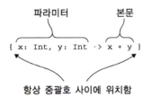
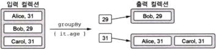
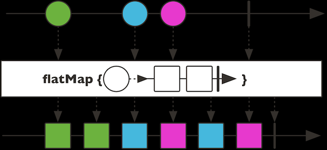
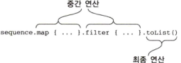

# 람다로 프로그래밍

> 람다 `lambda`는 기본적으로 다른 함수에 넘길 수 있는 작은 코드 조각을 뜻한다

람다를 사용하면 쉽게 공통 코드 구조를 라이브러리 함수로 뽑아낼 수 있다.

---
## 람다 식과 멤버 참조

자바에서는 익명 내부 클래스를 통해 이런 목적을 달성했다.

익명 내부 클래스를 사용하면 코드를 함수에 넘기거나 변수에 저장할 수 있기는 하지만 상당히 번거롭다.

이와 달리 함수형 프로그래밍에서는 함수를 값처럼 다루는 접근 방법을 택함으로써 이 문제를 해결한다.

클래스를 선언하고 그 클래스의 인스턴스를 함수에 넘기는 대신 함수형 언어에서는 함수를 직접 다른 함수에 전달할 수 있다.

람다 식을 사용하면 코드가 더욱 더 간결해진다.

람다 식을 사용하면 함수를 선언할 필요가 없고 코드 블록을 직접 함수의 인자로 전달할 수 있다.

그런데 이거 자바8에서도 람다식을 통해서 되서 의미가 있나 싶은데...

### 람다와 컬렉션

람다가 없다면 컬렉션을 편리하게 처리할 수 있는 좋은 라이브러리를 제공하기 힘들다.

자바에서 스트림 연산자를 통해 처리함...?

자바 컬렉션에 대해 (자바 8 이전에) 수행하던 대부분의 작업은 람다나 멤버 참조를 인자로 취하는 라이브러리 함수를 통해 개선할 수 있다.

### 람다식의 문법



코틀린의 람다식 문법

코틀린 람다는 `{ }` 중괄호로 항상 둘러싸여 있다.

```kotlin
// 변수에 람다 저장
val sum = { x: Int, y: Int -> x + y }

println(sum(1,2)) // 변수에 저장된 람다 호출

{ println(42) }() // 람다식 선언과 바로 직접 호출, 별 의미도 없음

run { println(42) } // 위와 같은 역활, run 을 사용해 람다식 선언
```

코틀린에서는 함수를 일급객체로 쓰며, 함수가 인자 목록의 마지막으로 람다를 쓸 경우 밖으로 뺄수 있음

람다의 파라미터가 하나뿐이고 그 타입을 컴파일러가 추론할 수 있는 경우 it 을 바로 쓸 수 있다.

본문이 여러 줄로 이뤄진 경우 본문의 맨 마지막에 있는 식이 람다의 결과 값이 된다.

### 현재 영역에 있는 변수에 접근

자바 메소드 안에서 무명 내부 클래스를 정의할 때 메소드의 로컬 변수를 무명 내부
클래스에서 사용할 수 있다. 람다 안에서도 같은 일을 할 수 있다.

람다를 함수 안에서 정의하면 함수의 파라미터뿐 아니라 람다 정의의 앞에 선언된 로컬 변수까지 람다에서 모두 사용할 수 있다.

**자바와 다른 점 중 중요한 한 가지는 코틀린 람다 안에서는 파이널 변수가 아닌 변수에 접근할 수 있다는 점**

코틀린에서는 자바와 달리 람다에서 람다 밖 함수에 있는 파이널이 아닌 변수에 접근할 수 있고, 그 변수를 변경할 수도 있다

어떤 함수가 자신의 로컬 변수를 포획한 람다를 반환하거나 다른 변수에 저장한다면 로컬 변수의 생명주기와 함수의 생명주기가 달라질 수 있다.

포획한 변수가 있는 람다를 저장해서 함수가 끝난 뒤에 실행해도 람다의 본문 코드는 여전히 포획한 변수를 읽거나 쓸 수 있다.

파이널 변수를 포획한 경우에는 람다 코드를 변수 값과 함께 저장한다.

파이널이 아닌 변수를 포획한 경우에는 변수를 특별한 래퍼로 감싸서 나중에 변경하거나 읽을 수 있게 한 다음, 래퍼에 대한 참조를 람다 코드와 함께 저장한다

### 변수 포획

자바에서는 파이널 변수만 포획 가능하나

변경 가능한 변수를 포획할 경우, 배열을 선언하거나, 해당 변수를 필드로 하는 클래스 선언

( 배열이나 클래스의 인스턴스에 대한 참조를 `final` 로 선언하면 포획 가능)

코틀린에서 이런방법 필요 없이 가능하다

람다가 파이널 변수를 포획하면 그 변수의 값이 복사함 (자바와 동일)

변경 가능한 변수 포획시 벼수를 `Ref` 클래스 인스턴스에 넣고 , 람다 식내에서는 `Ref` 인스턴스의 필드를 변경 가능.

### 멤버 참조

코틀린에서는 자바 8과 마찬가지로 함수를 값으로 바꿀 수 있다.

`::` 를 사용하는 식을 멤버 참조라고 부른다.

멤버 참조는 프로퍼티나 메소드를 단 하나만 호출하는 함수 값을 만들어준다.

---
### 컬렉션 함수형 API
**함수형 프로그래밍 스타일을 사용하면 컬렉션을 다룰 때 편리하다**

대부분의 작업에 라이브러리 함수를 활용할 수 있고 그로 인해 코드를 아주 간결하게 만들 수 있다

### 필수적인 함수: filter와 map

`filter` 와 `map` 은 컬렉션을 활용할 때 기반이 되는 함수

`filter` 함수

- 컬렉션을 이터레이션하면서 주어진 식 (람다 등)에 각 원소를 넘겨 식에서 `true` 를 반환하는 원소만 모음

`map` 함수

- 컬렉션의 각 원소에 주어진 식 (람다 등)을 적용하여 새 컬렉션 생성
- A→B

### all, any, count, find : 컬렉션에 술어 적용

컬렉션의 모든 원소가 어떤 조건을 만족하는지 판단하는 연산 - `all` `any`

`count` 만족하는 갯수 반환, `find` 조건에 만족하는 첫 원소 반환

### groupBy: 리스트를 여러 그룹으로 이뤄진 맵으로 변경

컬렉션의 모든 원소를 어떤 특성에 따라 여러 그룹으로 나누고 싶을 경우



```kotlin
val people = listOf(Person("Alice", 31), Person("Bob",29), Person("Carol", 31))

people.groupBy { it.age }
```

각 그룹은 리스트다.

따라서 `groupBy` 의 결과 타입은 `Map<Int, List<Person>>`이다

필요하면 이 맵을 `mapKeys` 나 `mapValues` 등을 사용해 변경할 수 있다

### flatMap과 flatten: 중첩된 컬렉션 안의 원소 처리

`flatMap` 함수는 먼저 인자로 주어진 식을 컬렉션의 모든 객체에 적용하고 식을 적용한 결과 얻어지는 여러 리스트를 한 리스트로 모은다.

단순하게 `flat` 과 `map` 의 조합



이 외에도 많은 함수가 존재 하지만 일반적으로 사용되는 연산과 유사함

---
### 지연 계산(lazy) 컬렉션 연산
`map` 이나 `filter` 와 같은 컬렉션 함수API들은 결과 컬렉션을 **즉시** 생성한다

이는 컬렉션 함수를 연쇄(메소드 체이닝)하면 매 단계마다 계산 중간 결과를
**새로운 컬렉션에 임시로 담는다는 말이다**

코틀린에서는 `시퀀스 sequence` 를 사용하면 중간 임시 컬렉션을 사용하지 않고 연쇄시킬 수 있다

### 예시로 살펴보기

```kotlin
people
	.map(Person::name)
	.filter {it.startsWith("A")}
```

위와 같은 연쇄 호출시 리스트 2개가 생성된다

원소가 많으면 많을 수록 효율이 떨어지므로 효율성을 위해 시퀀스로 변경하면...

```kotlin
people.asSequence()  // 원본 컬렉션을 시퀀스로 변환
	.map(Person::name) // 시퀀스로 변환 후에도 같은 컬렉션 API 사용 가능
	.filter { it.startsWith("A") }
	.toList() // 시퀀스를 다시 리스트로 변환.
```

예제에서는 중간 결과를 저장하는 컬렉션이 생기지 않기 때문에 원소가 많은 경우 성능이 눈에 띄게 좋아진다.

코틀린 지연 계산 시퀀스는 Sequence 인터페이스에서 시작한다

이 인터페이스는 단지 한 번에 하나씩 열거될 수 있는 원소의 시퀀스를 표현할 뿐이다

`Sequence` 안에는 `iterator` 라는 단 하나의 메소드가 있다

`Sequence` 인터페이스의 강점은

그 인터페이스 위에 구현된 연산이 계산을 수행하는 방법 때문에 생긴다.

시퀀스의 원소는 필요할 때 비로소 계산된다.

따라서 중간 처리 결과를 저장하지 않고도 연산을 연쇄적으로 적용해서 효율적으로 계산을 수행할 수 있다

시퀀스에 대한 연산을 지연 계산하기 때문에 정말 계산을 실행하게 만들려면

최종 시퀀스의 원소를 하나씩 이터레이션하거나 최종 시퀀스를 리스트로 변환해야 한다.

### 시퀀스 연산 실행: 중간 연산과 최종 연산

시퀀스에 대한 연산은 `중간연산 intermediate` 과 `최종 연산 terminal` 으로 나뉜다



중간 연산은 항상 지연 계산되며 최종 연산이 호출 될때 적용이 된다.

시퀀스의 경우 모든 연산은 각 원소에 대해 순차적으로 적용된다

### 시퀀스 만들기

시퀀스를 만드는 다른 방법으로 `generateSequence` 함수를 사용할 수 있다

예제

```kotlin
val naturalNumbers = generateSequence(0) { it + 1 }
val numbersTo100 = nauturalNumbers.takeWhile { it <= 100 }
numbersTo100.sum() // 이때 지연 연산 결과를 위해 수행
```
---
### 자바 함수형 인터페이스 활용
코틀린 람다를 자바 API 에 사용해도 아무 문제가 없다는 사실

자바에서 `함수형 인터페이스` 또는 `SAM 인터페이스` 에 대응 가능한 코틀린의 문법...

자바와 달리 코틀린에는 제대로 된 함수 타입이 존재한다.

따라서 코틀린에서 함수를 인자로 받을 필요가 있는 함수는 함수형 인터페이스가 아니라 함수 타입을 인자 타입으로 사용해야 한다

### 자바 메소드에 람다를 인자로 전달

함수형 인터페이스를 인자로 원하는 자바 메소드에 코틀린 람다를 전달할 수 있다

예시

`void postponeComputation(int delay, Runnable computation);`

```kotlin
postponeComputation(1000) { println(42) }
```

컴파일러가 람다 식을 Runnable 인스턴스로 변환해줌

```kotlin
postponeComputation(1000, object : Runnable {
	override fun run() {
		println(42)
	}
})
```

익명 객체를 명시적으로 만들어서 사용할 수도 있다

객체를 명시적으로 선언하는 경우 메소드를 호출할 때마다 새로운 객체가 생성된다.

람다는 다르다. 정의가 들어있는 함수의 변수에 접근하지 않는 람다에 대응하는 무명 객체를 메소드를 호출할 때마다 반복 사용한다.

프로그램 전체에서 단 하나만 만들어짐

람다 내에서 외부 변수를 가져와 쓸경우 같은 인스턴스를 쓸수 없으므로 매번 새롭게 생성.

### SAM 생성자: 람다를 함수형 인터페이스로 명시적으로 변경

`SAM 생성자`는 람다를 함수형 인터페이스의 인스턴스로 변환할 수 있게 컴파일러가 자동으로 생성한 함수다

컴파일러가 자동으로 람다를 함수형 인터페이스 무명 클래스로 바꾸지 못하는 경우 `SAM 생성자`를 사용할 수 있다

예시

```kotlin
fun createAllDoneRunnable(): Runnable {
	return Runnable { println("All done!") }
}

createAllDoneRunnable().run()

```

`SAM 생성자`의 이름은 사용하려는 함수형 인터페이스의 이름과 같다

`SAM 생성자`는 그 함수형 인터페이스의 유일한 추상 메소드의 본문에 사용할 람다만을 인자로 받아서 함수형 인터페이스를 구현하는 클래스의 인스턴스를 반환한다

람다로 생성한 함수형 인터페이스 인스턴스를 변수에 저장해야 하는 경우에도 `SAM 생성자`를 사용할 수 있다

---
### 수신 객체 지정 람다:with와 apply
코틀린 표준 라이브러리의 `with`와 `apply` - 수신 객체 지정 람다 `lambda with receiver`

수신 객체를 명시하지 않고 람다 본문 안에서 다른 객체의 메소드를 호출할 수 있게 하는 것

### with 함수

어떤 객체의 이름을 반복하지 않고도 그 객체에 대해 다양한 연산을 수행할 수 있다

예시

```kotlin
// with 안쓰고 만들기
fun alphabet(): String {
	val result = StringBuilder()
	for (letter in 'A'..'Z') {
		result.append(letter)
	}
	result.append("\nNow I know the alphabet!")
	return result.toString()
}
```

```kotlin
// with 쓰고 만들기
fun alphabet(): String {
	val stringBuilder = StringBuilder()
	return with(stringBuilder) {
		for (letter in 'A'..'Z') {
			this.append(letter)
		}
		append("\nNow I know the alphabet!")
		this.toString()
	}
}
```

`with` 문은 파라미터가 2개 있는 함수

예제에서는 `StringBuilder` 와 람다를 사용

```kotlin
// 식으로 바로 반환하며 불필요한 변수 제외
fun alphabet() = with(StringBuilder()) {
	for (letter in 'A'..'Z') {
		append(letter)
	}
	append("\nNow I know the alphabet!")
	toString()
}
```

### apply 함수

`apply` 는 항상 자신에게 전달된 객체를 반환함

```kotlin
fun alphabet() = StringBuilder().apply {
	for(letter in 'A'..'Z') {
		append(letter)
	}
	append("\nNow I know the alphabet!")
}.toString()
```

`apply` 는 확장 함수로 정의되어 수신 객체가 전달받은 람다의 수신 객체가 됨.

객체의 인스턴스를 만들면서 즉시 프로퍼티 중 일부를 초기화해야 하는 경우 유용하다.